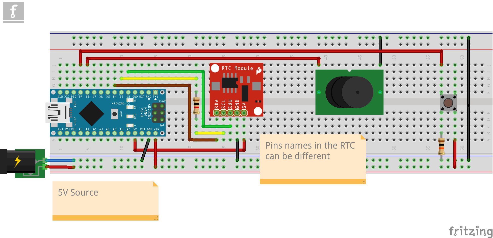

# Alarma Despertador con Arduino

# Table of Contents

1.  [Resúmen](#orgc8c04ef)
    1.  [Componentes](#orga7fe39a)
    2.  [Diagrama](#org42eacd7)
    3.  [Configuración inicial](#orgca5222e)
2.  [Descripción](#org34c1bb4)
    1.  [Módulo DS1302](#org60ddc08)
    2.  [Buzzer TMB12A05, botón y alimentación](#orga4d537b)

# Resúmen

Alarma despertador en Arduino.

## Componentes

-   Arduino Micro
-   Módulo RTC DS1302
-   Buzzer TMB12A05
-   Botón de 4 Pines
-   Alimentador de 5V.

## Diagrama

## Configuración inicial

1.  Instalar la librería `Ds1302`.
2.  Cargar el programa SetClock.
3.  Abrir el Monitor desde el IDE de Arduino.
4.  Introducir la fecha y hora en el formato pedido `YYMMDDWhhmmss`:
    -   `YY` dos último digitos del año
    -   `MM` mes en número (1 es Enero)
    -   `DD` día del mes
    -   `W` día de la semans (1 es Lunes)
    -   `hh` hora
    -   `mm` minuto
    -   `ss` segundos
5.  Cargar el programa Alarma. Para probar que la fecha está funcionando correctamente descomentar las líneas que están después de este comentario:
    
        // Imprimir en el Monitor las fecha y hora
6.  Variables:
    
        // Máximo de minutos que puede sonar la alarma
        const int MAX_MINUTES = 5;
        
        // Arreglo de alarmas, {hora, minuto}
        const int Alarmas[][2] = {
            {5, 30},
            {5, 45},
            {6, 0},
            {6, 30},
            {7, 0},
        };

# Descripción

En los últimos meses me di cuenta de una tendencia relacionada con la tecnología.
Se trata de dejar de usar nuestro teléfonos celulares como alarmas.
Esto para evitar estar tanto tiempo en contacto con estos dispositivos.

En mi caso, tengo que aceptar que a veces me despierto, tomar mi celular y directamente lo que hago es abrir mis redes sociales.
Esto hace que desperdicie varios minutos de la mañana en cosas no productivas.

Entonces, se recomienda usar un despertador de los que la gente solía usar antes de la popularización de los smartphones con alarmas.

Yo, decidí llevarlo un poco más lejos y usar lo que sé para resolver este problema a mi manera.
Aprovechando mis conocimientos en programación y, más especificamente, en programación en Arduino decidí hacer mi propia alarma despertador.

Haciendo una búsqueda en los foros de makers de Arduino, encontré [este post](https://www.instructables.com/Arduino-Alarm-Clock-3/).
La idea es usar un módulo RTC para que el Arduino tenga una forma de obtener la hora real del día.
Estos módulos son capaces de guardar la fecha y la hora a pesar de que el Arduino no esté conectado a una fuente de energía, ya que tiene una batería que le permite estar trabajando.

Yo utilicé un módulo RTC DS1302, que es uno de los más viejos que hay disponibles.
Pero funciona relativamente bien, después de un tiempo de uso solo puedo resaltar que a veces se desconfigura la hora.

Además del se necesita de un dispositivo que emita un sonido.
Yo voy a usar un Buzzer TMB12A05.

## Módulo DS1302

Siguiendo las indicaciones de [este tutorial de Arduino Get Started](https://arduinogetstarted.com/tutorials/arduino-ds1307-rtc-module), se supone que debo usar una librería específica para mi módulo de RTC.

Por fortuna ya existe una librería en [GitHub](https://github.com/Treboada/Ds1302), que también se encuentra en la sección de Librerias de Arduino como **Ds1302**.

Dentro del repo de GitHub nos encontramos con dos ejemplos importantes para usar la librería.
Uno es para [cambiar la fecha y hora del RTC](https://github.com/Treboada/Ds1302/blob/master/examples/02/SetDateTime.cpp#L32) y otro ejemplo es el uso de esta librería para [obtener la fecha y hora del RTC](https://github.com/Treboada/Ds1302/blob/master/examples/01/GetDateTime.cpp).

Para saber las conexiones entre el módulo y la Arduino usé [este tutorial](https://create.arduino.cc/projecthub/SurtrTech/simple-alarm-clock-with-ds1302-rtc-a92d7b).

Usando los ejemplos que vienen en la librería del Módulo, primero configuré la fecha y hora.
Cargamos el ejemplo a la Arduino y abrimos el Monitor, en este debemos ingresar la fecha y hora en el formato que indica (W se refiere al número del día de la semana, dónde 1 es Lúnes y 7 Domingo).

Ya configurada correctamente la fecha y hora en el RTC, podemos probar que la fecha y hora sean las correctas con el siguiente ejemplo de la librería para obtener la fecha y hora.
Cargamos el programa a la Arduino y veremos en el monitor la fecha y hora.

## Buzzer TMB12A05, botón y alimentación

Necesitaba una fuente de sonido para la alarma, decidí usar un Buzzer.
Siguiendo [este video-tutorial](https://www.youtube.com/watch?v=_yrTKvc4mh8), obtuve el código para poder generar sonido en el Buzzer.

Dentro de la lógica programada, la alarma se puede apagar usando un botón.
Usé un botón de 4 Pines.

Para alimentar todo el circuito, incluido la Arduino, usé un alimentador de 5 V.

